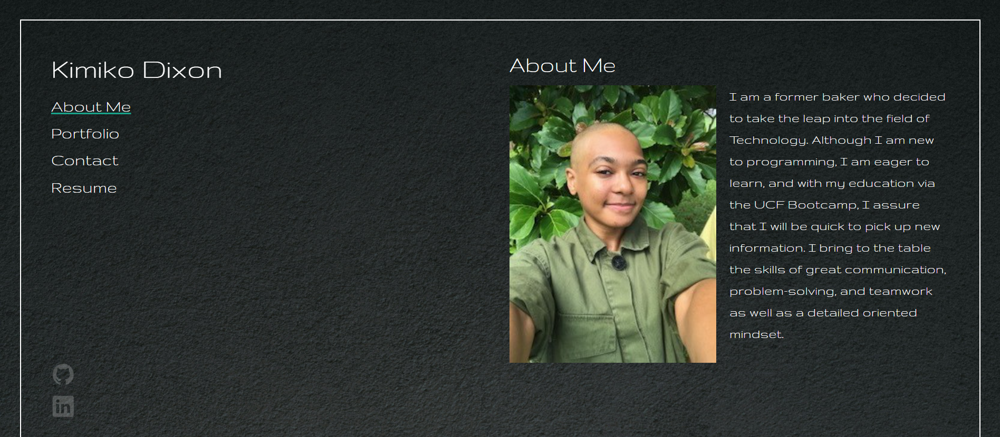
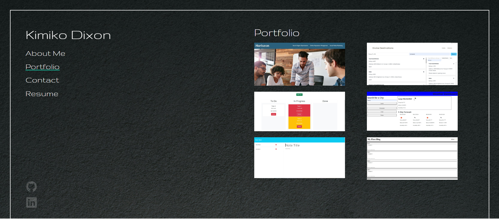
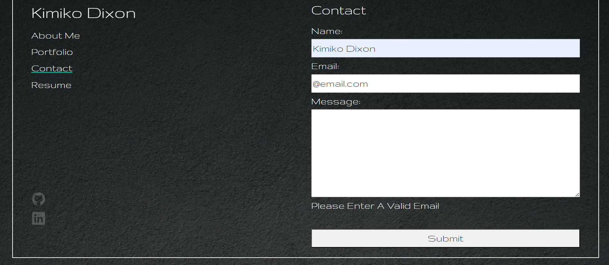
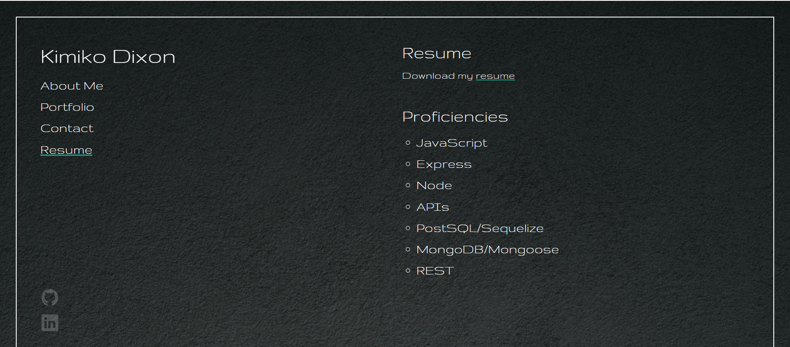

# React Portfolio

## Description

This is a front-end portfolio that was built with React.

[Deployed Application](https://kimiko-dixon-portfolio.netlify.app/)

## Usage

To use this application, click on the navigation links to go to the different pages of the portfolio or click on the links in the footer to go to my GitHub or LinkedIn profile.  On the portfolio page when a project is hovered over there will be a link to the deployed application and a link to the GitHub repository. On the contact page, there is a form that, when not filled with valid information, will not allow for submissions. On the resume page, there is a downloadable link of my resume.
## Credits

N/A

## License

LICENSE in repo.